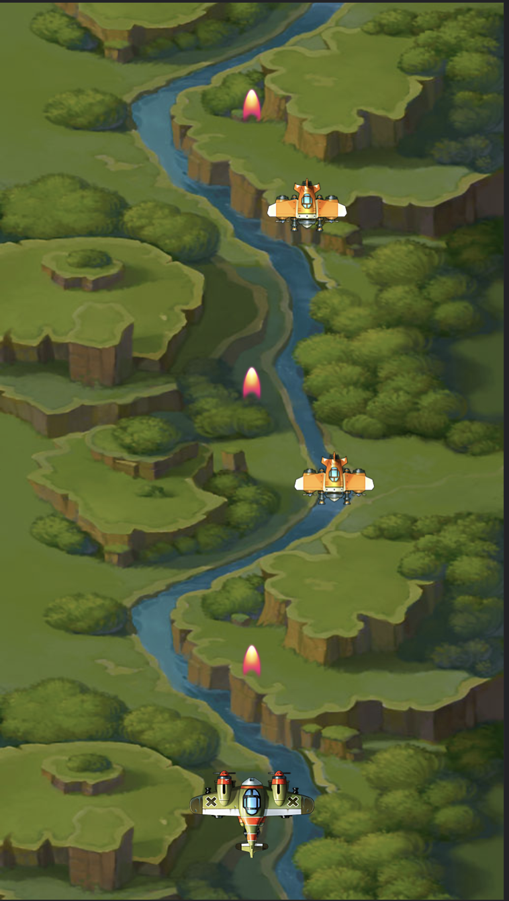

# cocos 飞机大战

素材来自微信小游戏示例

### 展示

TODO

## 
星星消失动画 [done]
测试play idle无效 蘑菇和星星都有这样的问题！
飞机移动有问题！

执行顺序：
未加入node节点的时候：reset
加入后先后执行onLoad start

如果node是play动画的！那么从nodepool里面出来以后不会执行onLoad() start() 动画已经到结尾了！怎么办？？;

## 计划

1. 子弹：
 - 小子弹 逐渐变大
 - 放大版子弹
 - 多种样式混合
 - 一次发射固定排列的子弹，比如 
     | |
    | | | 
 - 射线扫屏子弹
2. 道具：
 - 吃level升级道具
 - 生命道具
 - 变换子弹道具

3. 掉落：
 - 上面飞速掉落 砖块，砖块有生命，部分可打掉，类似于是男人就下一百层，
 - 雪人扔雪球，只能躲开，雪球爆炸产生子弹！

4. 敌军：
 - 一次排列出门 一会排成个人字，一会排成一字 一字长舌……二龙戏猪
 - 敌军发射子弹
 - 敌军有血量 hp

5. 创意：
 - 增加魔法值创意！！！！
 - 马里奥的水管，生成地图，从某个地方出来敌军！
 - 伪装敌军！可以开枪！哈哈哈
